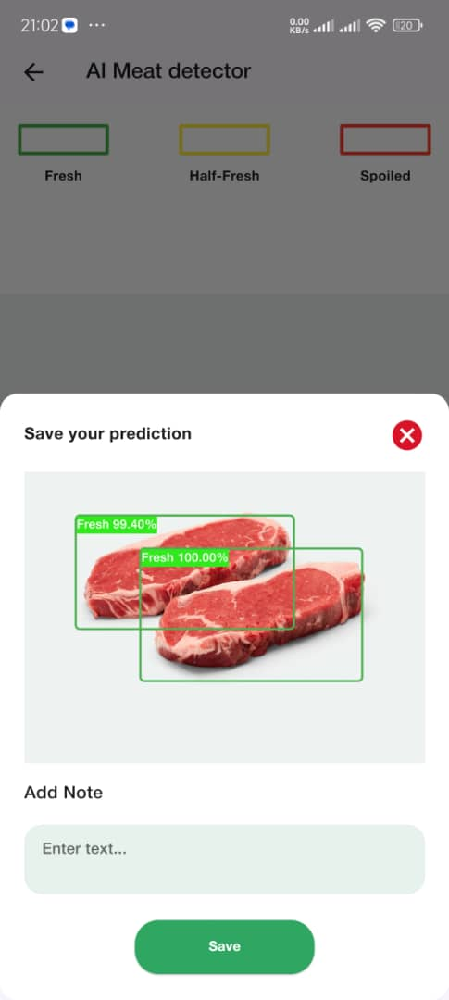
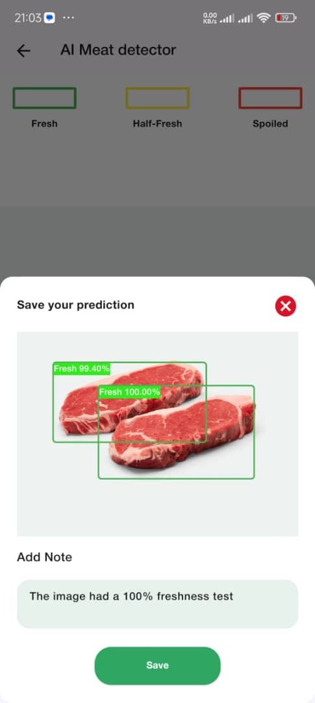
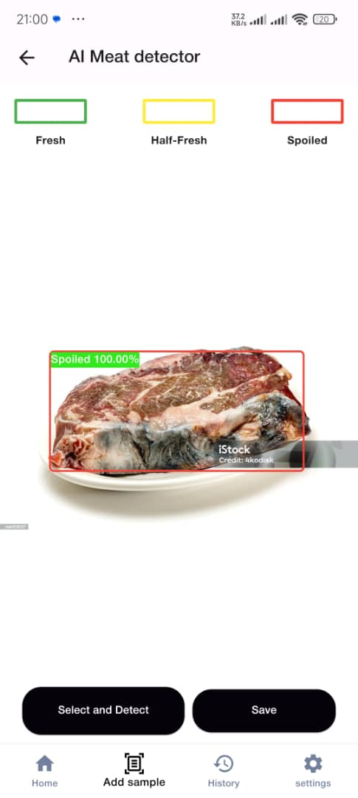

# AI-Based Meat Quality Inspection System

The AI-Based Meat Quality Inspection System is designed to address the challenges faced by the global meat industry in ensuring product quality and safety. By leveraging advanced artificial intelligence technologies, this system automates and enhances the meat quality inspection process, improving the detection of contaminants, evaluating freshness, recognizing defects, and ensuring compliance with safety standards. This fosters consumer trust and enhances food safety.

## Features

- **Automated Meat Quality Inspection:**
  - Detects contaminants in meat samples.
  - Evaluates the freshness of meat.
  - Recognizes defects in meat samples.
  - Ensures compliance with safety standards.

- **AI Models:**
  - Classification model for determining meat freshness and contamination levels.
  - YOLOv5 object detection model for identifying meat samples in images.

- **Integration:**
  - Both models are integrated into a Flutter application.
  - The object detection model identifies and isolates meat samples.
  - The classification model evaluates the isolated samples for quality assessment.

## Models and Training

### Classification Model

- **Development Environment:**
  - Google Colab: A cloud-based platform for writing and executing code in a Jupyter Notebook-style environment.

- **Modules Used:**
  - Pandas, NumPy, Scikit-learn, Decision Tree, TensorFlow

- **Dataset:**
  - 675 images of fresh meat
  - 630 images of half-fresh meat
  - 510 images of spoiled meat

- **Preprocessing:**
  - Image resizing for faster training and better performance.
  - Images were resized before training.

- **Training:**
  - The model was trained using 50 epochs.
  - Images were labeled and used for training the neural network.

- **TFLite Conversion:**
  - The trained model was converted to TensorFlow Lite (TFLite) format for optimized mobile and embedded device inference.

### Object Detection Model with YOLOv5

- **Dataset:**
  - Collected from Roboflow, with a total of 3933 images.
  - Classes: Meat and Ingredient-Other

- **Augmentation Techniques:**
  - Horizontal flip
  - ±15° horizontal and vertical shear
  - Grayscale applied to half of the images

- **Preprocessing:**
  - Auto-Orientation
  - Resize: Stretch to 640x640
  - Modify Classes: 114 remapped, 0 dropped

- **Data Splitting:**
  - Training: 3581 images
  - Validation: 451 images
  - Testing: 132 images

## Integration of Models

- **Object Detection:**
  - The YOLOv5 object detection model detects meat samples in an image and provides their coordinates.
  - Implemented using the TFLite object detection model embedded in the Flutter application.

- **Image Cropping:**
  - Coordinates from the object detection model are used to crop the image, isolating the meat samples.

- **Classification:**
  - The cropped images are fed into the classification model.
  - The classification model predicts the freshness and contamination levels of the meat.

- **Screenshoots:**
  
  
  
  

## Installation

To set up the project locally, follow these steps:

1. **Clone the Repository:**
   ```sh
   git clone <repository-url>
   cd <repository-directory>
